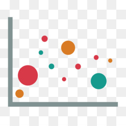
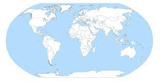

## Welcome!!!

Speech recognition is an interdisciplinary subfield of computer science and computational linguistics that develops methodologies and technologies that enable the recognition and translation of spoken language into text by computers. 

  

It is a interesting field that will be covered in this Shiny app, the main sections of this app are,

## **Filter**

This section will filter a dataframe according with a specific column. In this case we are using the iris dataset and we use the "Specie" columns to filter.

  **Instructions**:

  In order to use this section, the user need to say the word "type" (it is a key word) follow by the name of the specie of the flower (setosa, virginica and versicolor), setosa level is the specie set as default.

  

## **Plot**

This section works with a dispersion diagram of the iris dataset, there are three options to this section,

* Change the name of the plot.
* Change de color of the plot.
* Change the size of the plot.

  **Instructions**:

* To change the name of the plot it is necessary to say the key word "title" and then say the name that we want.

* To change the color of the plot it is necessary to say the key word "color" an then say the color that we want.

* To change the size of the points in the dispersion diagram it is necessary to say "bigger" if we want to increse the size of the points, on the contrary say "samller" if we want to decrease the size of the points.

  

## **Map**

This section works with an interactive map which detect the name of the country and then find and highlight it in the world map. It can help to show important information from a specific country.

  **Instructions**:

* To find a country is necessary to say the key word "country" follow by the name of the country.

  

 
